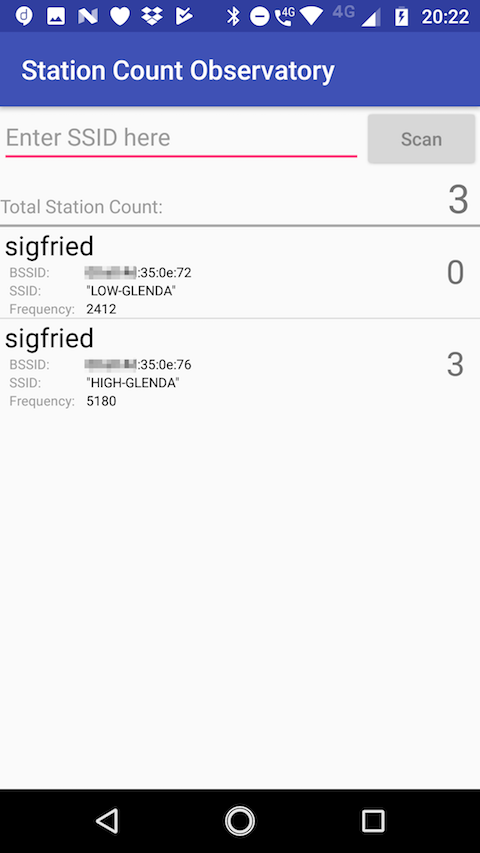
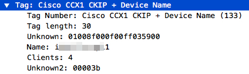
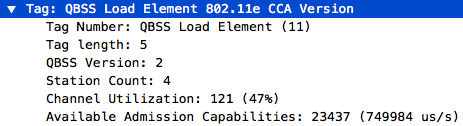

**Station Count Observatory** is an Android application for collecting Aironet IE.
The app displays "Station Count" for each "Device Name" and sums up total clients
seen in neighbour APs.



- Textbox is for filtering SSID with given string
- push "Scan" button to renew scan list


## Aironet IE ()



"CCX1 CKIP + Device Name" IE (i.e. Aironet IE) is Information Element used in Cisco AP (and some other device).
This IE contains AP's hostname and number of stations associated to the AP.


```
 0                   1                   2                   3
 0 1 2 3 4 5 6 7 8 9 0 1 2 3 4 5 6 7 8 9 0 1 2 3 4 5 6 7 8 9 0 1
+-+-+-+-+-+-+-+-+-+-+-+-+-+-+-+-+-+-+-+-+-+-+-+-+-+-+-+-+-+-+-+-+
|  Tag(1 Byte)  |   Length(1)   |                               |
+-+-+-+-+-+-+-+-+-+-+-+-+-+-+-+-+                               +
|                                                               |
+                          Unknown1(10)                         +
|                                                               |
+-+-+-+-+-+-+-+-+-+-+-+-+-+-+-+-+-+-+-+-+-+-+-+-+-+-+-+-+-+-+-+-+
|                                                               |
+                                                               +
|                                                               |
+                         DeviceName(16)                        +
|                                                               |
+                                                               +
|                                                               |
+-+-+-+-+-+-+-+-+-+-+-+-+-+-+-+-+-+-+-+-+-+-+-+-+-+-+-+-+-+-+-+-+
|   Clients(1)  |                  Unknown2(3)                  |
+-+-+-+-+-+-+-+-+-+-+-+-+-+-+-+-+-+-+-+-+-+-+-+-+-+-+-+-+-+-+-+-+
```

- Tag is always 133 (0x85), 1 byte field
- Length is always 30, 1 byte field
- Unknown1 is 10 bytes field with unknown content
- **DeviceName** contains Device Name(= hostname?), zero padded to 16 bytes field
- **Clients** contains hexadecimal station count, 1 byte field
  - Though the beacon belongs to single SSID, it is likely that this fields contains sum of clients for each band
  - e.g) if AP has 2 SSID in 2.4GHz and 2 SSID in 5GHz and each clients are 2, 3, 5, 6, then Clients field in all 2.4GHz Beacon is 5 (2+3) while 11 (5+6) in 5GHz.
- Unknown2 is 3 bytes field with unknown content

## ref. QBSS Load IE

Some devices reports it's number of associated clients with QBSS Load IE.
While this IE does not contains Device Name, it includes channel utilization and available media time.




```
 0                   1                   2                   3
 0 1 2 3 4 5 6 7 8 9 0 1 2 3 4 5 6 7 8 9 0 1 2 3 4 5 6 7 8 9 0 1
+-+-+-+-+-+-+-+-+-+-+-+-+-+-+-+-+-+-+-+-+-+-+-+-+-+-+-+-+-+-+-+-+
|  Tag(1 Byte)  |   Length(1)   |        Station Count(2)       |
+-+-+-+-+-+-+-+-+-+-+-+-+-+-+-+-+-+-+-+-+-+-+-+-+-+-+-+-+-+-+-+-+
| Utilization(1)|    AvailableCapabilities(2)   |
+-+-+-+-+-+-+-+-+-+-+-+-+-+-+-+-+-+-+-+-+-+-+-+-+
```

- Tag is always 11, 1 byte field
- Length is always 5, 1 byte field
- Station Count contains a number of associated stations in each band (same as Clients in Aironet IE)
- Utilization contains its detected channel utilization in per-255, 2 bytes field.
  - e.g) utilization = occupied_time * 255 / total_time
- Available Admission Capabilities contains not-occupied media time in 32us.
  - e.g) available_caps = not_occupied_us / 32